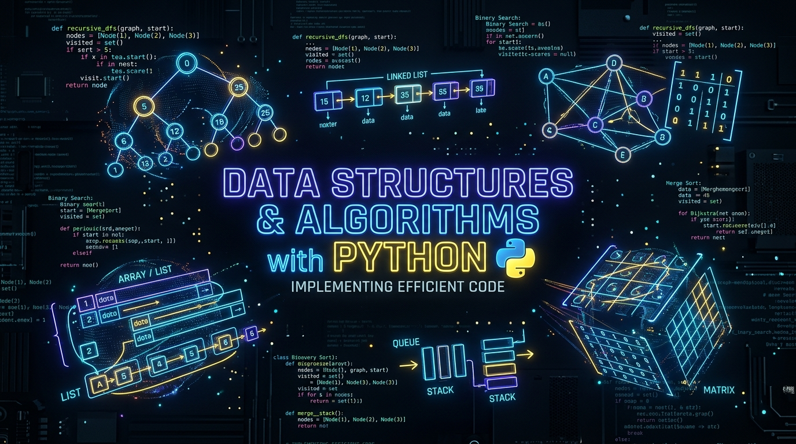

<div align="center">

<!-- Project Hero Banner -->
<a href="https://github.com/imCoderAditya/DSA-With-Python">
  
</a>

<br/><br/>

<!-- Typing Animation -->
<a href="https://github.com/imCoderAditya/DSA-With-Python">
  
</a>

<br/>

<!-- Shields.io Main Badges (Row 1: Technology & Frameworks) -->
<p align="center">
  <a href="https://www.python.org/"></a>
  <a href="BOOK/00_Index_and_Introduction.md"></a>
  <a href="PROBLEMS/01_Arrays_Strings_Problems.md"></a>
  <a href="INTERVIEW/01_Arrays_Strings_Interview_QA.md"></a>
  <a href="https://github.com/imCoderAditya/DSA-With-Python/blob/main/LICENSE"></a>
</p>

<!-- Shields.io Live Repository Statistics (Row 2: Dynamic GitHub Stats) -->
<p align="center">
  <a href="https://github.com/imCoderAditya/DSA-With-Python/stargazers"></a>
  <a href="https://github.com/imCoderAditya/DSA-With-Python/network/members"></a>
  <a href="https://github.com/imCoderAditya/DSA-With-Python/issues"></a>
  <a href="https://github.com/imCoderAditya/DSA-With-Python/commits/main"></a>
  <a href="https://github.com/imCoderAditya/DSA-With-Python"></a>
</p>

<!-- Quick Action Buttons -->
<p align="center">
  <a href="BOOK/00_Index_and_Introduction.md"><b>📖 Start Reading Book</b></a> •
  <a href="PROBLEMS/01_Arrays_Strings_Problems.md"><b>📝 Practice Problems</b></a> •
  <a href="SOLUTIONS/01_Arrays_Strings_Solutions.md"><b>💡 View Solutions</b></a> •
  <a href="INTERVIEW/01_Arrays_Strings_Interview_QA.md"><b>🎯 Interview Q&A</b></a>
</p>

</div>

---


## 🌟 Key Highlights & Features

<table>
  <tr>
    <td width="50%">
      <br/>
      <b>📖 Deep-Dive Theory & ASCII Visuals</b>
      <p>From fundamental Asymptotic Analysis & Recursion to advanced Segment Trees, Trie, and Graph algorithms with complete mathematical proofs and memory layouts.</p>
    </td>
    <td width="50%">
      <br/>
      <b>⚡ Rigorous Complexity Focus</b>
      <p>Every single algorithm includes complete <b>Best, Average, and Worst-case Time Complexities</b> alongside precise <b>Auxiliary Space Complexity</b> breakdowns.</p>
    </td>
  </tr>
  <tr>
    <td width="50%">
      <br/>
      <b>🎯 Top-Tier Interview Q&A</b>
      <p>Real-world conceptual questions with in-depth interviewer expectation insights, tricky edge-cases, and trade-off comparisons.</p>
    </td>
    <td width="50%">
      <br/>
      <b>📝 Topic-Wise Problems & Solutions</b>
      <p>Handcrafted problem sets accompanied by step-by-step intuitive solutions written in clean, idiomatic, type-hinted modern Python.</p>
    </td>
  </tr>
</table>

---

## 🧭 Repository Structure

```tree
📦 DSA-With-Python
 ┣ 📂 MY_PRACTICE/          # 💻 Your Personal Practice Code Files (.py for all 20 topics)
 ┃ ┣ 🐍 01_asymptotic_analysis.py
 ┃ ┣ 🐍 02_recursion_backtracking.py
 ┃ ┣ 🐍 ...
 ┃ ┗ 🐍 20_advanced_data_structures.py
 ┣ 📂 BOOK/                 # 20 Complete Interactive Textbook Chapters
 ┃ ┣ 📜 00_Index_and_Introduction.md
 ┃ ┣ 📜 Chapter_01_Asymptotic_Analysis.md
 ┃ ┣ 📜 Chapter_02_Recursion_and_Backtracking.md
 ┃ ┣ 📜 ...
 ┃ ┗ 📜 Chapter_20_Advanced_Data_Structures.md
 ┣ 📂 PROBLEMS/             # Topic-Wise Curated Practice Problems (.md)
 ┃ ┣ 📜 01_Arrays_Strings_Problems.md
 ┃ ┣ 📜 02_Linked_Lists_Problems.md
 ┃ ┗ 📜 ...
 ┣ 📂 SOLUTIONS/            # Production-Grade Optimal Solutions (.md)
 ┃ ┣ 📜 01_Arrays_Strings_Solutions.md
 ┃ ┣ 📜 02_Linked_Lists_Solutions.md
 ┃ ┗ 📜 ...
 ┣ 📂 INTERVIEW/            # FAANG & Top Tech Conceptual Interview Q&A (.md)
 ┃ ┣ 📜 01_Arrays_Strings_Interview_QA.md
 ┃ ┣ 📜 02_Linked_Lists_Interview_QA.md
 ┃ ┗ 📜 ...
 ┗ 📜 README.md             # Project Master Dashboard
```

---


## 📖 1. Master Digital Textbook (20 Chapters)

<div align="center">
  <a href="BOOK/00_Index_and_Introduction.md">
    
  </a>
</div>

<br/>

| # | Part | Chapter Title | Core Topics Covered | Status |
|:---:|:---:|:---|:---|:---:|
| **01** | **I** | [**Asymptotic Analysis & Complexity**](BOOK/Chapter_01_Asymptotic_Analysis.md) | Big-O, $\Omega$, $\Theta$, Amortized Analysis, Master Theorem, Python Internals |  |
| **02** | **I** | [**Recursion & Backtracking**](BOOK/Chapter_02_Recursion_and_Backtracking.md) | Call Stack, Base Conditions, N-Queens, Subsets, Permutations, Sudoku |  |
| **03** | **I** | [**Arrays, Strings & Sliding Window**](BOOK/Chapter_03_Arrays_Strings_TwoPointers_SlidingWindow.md) | Dynamic Arrays, Kadane's Algo, Dutch National Flag, Two Pointers, Sliding Window |  |
| **04** | **I** | [**Linked Lists**](BOOK/Chapter_04_Linked_Lists.md) | Singly, Doubly, Circular, Floyd's Cycle Detection, Reversal, K-Group Reverse |  |
| **05** | **I** | [**Stacks**](BOOK/Chapter_05_Stacks.md) | LIFO, Infix/Postfix Parsing, Min Stack $O(1)$, Monotonic Stack, Histogram Area |  |
| **06** | **I** | [**Queues & Deques**](BOOK/Chapter_06_Queues_and_Deques.md) | FIFO, Circular Queue Buffer, Monotonic Deque, Sliding Window Maximum |  |
| **07** | **II** | [**Trees & Binary Trees**](BOOK/Chapter_07_Trees_and_Binary_Trees.md) | Traversals (Pre/In/Post/Level), Tree Views, LCA, Diameter, Serialization |  |
| **08** | **II** | [**Binary Search Trees (BST) & AVL**](BOOK/Chapter_08_Binary_Search_Trees_and_AVL.md) | BST Invariant, Insertion, 3-Case Deletion, AVL Rotations (LL, RR, LR, RL) |  |
| **09** | **II** | [**Priority Queues & Binary Heaps**](BOOK/Chapter_09_Priority_Queues_and_Heaps.md) | Min/Max Heap, Array Storage, $O(N)$ Heapify, `heapq`, Running Median |  |
| **10** | **II** | [**Disjoint Set Union (DSU) & Tries**](BOOK/Chapter_10_Disjoint_Set_and_Tries.md) | Union by Rank, Path Compression, Trie (Insert, Search, StartsWith), Autocomplete |  |
| **11** | **II** | [**Graph Algorithms**](BOOK/Chapter_11_Graph_Algorithms.md) | BFS, DFS, Kahn's Topo Sort, Dijkstra, Bellman-Ford, Floyd-Warshall, MST |  |
| **12** | **III** | [**Sorting Algorithms**](BOOK/Chapter_12_Sorting_Algorithms.md) | Bubble, Selection, Insertion, Merge Sort, Quick Sort, Counting, Radix Sort |  |
| **13** | **III** | [**Searching Algorithms**](BOOK/Chapter_13_Searching_Algorithms.md) | Linear & Binary Search, Lower/Upper Bound, Binary Search on Answer Space |  |
| **14** | **III** | [**Hashing & Hash Tables**](BOOK/Chapter_14_Hashing.md) | Hash Functions, Chaining vs Probing, LRU Cache in $O(1)$, Prefix Sum Hashing |  |
| **15** | **III** | [**Greedy Algorithms**](BOOK/Chapter_15_Greedy_Algorithms.md) | Activity Selection, Fractional Knapsack, Huffman Coding, Gas Station |  |
| **16** | **III** | [**Divide and Conquer**](BOOK/Chapter_16_Divide_and_Conquer.md) | Binary Exponentiation, QuickSelect in $O(N)$, Master Theorem Recurrences |  |
| **17** | **IV** | [**Dynamic Programming (DP)**](BOOK/Chapter_17_Dynamic_Programming.md) | 1D DP, 0/1 & Unbounded Knapsack, LCS, LIS in $O(N \log N)$, Edit Distance |  |
| **18** | **IV** | [**Bit Manipulation**](BOOK/Chapter_18_Bit_Manipulation.md) | Bitwise Tricks, Power of 2, Single Number variants, Bitmask Subsets |  |
| **19** | **IV** | [**String Matching Algorithms**](BOOK/Chapter_19_String_Algorithms.md) | KMP Algorithm (LPS Array), Rabin-Karp Rolling Hash, Z-Algorithm |  |
| **20** | **IV** | [**Advanced Data Structures**](BOOK/Chapter_20_Advanced_Data_Structures.md) | Segment Tree with Lazy Propagation, Fenwick Tree (Binary Indexed Tree) |  |

---


## 📝 2. Practice Problems, Solutions & Interview QA (.md)

| 🏷️ Topic | 📝 Practice Problems | 💡 Optimal Solutions | 🎯 Interview Q&A |
|:---|:---:|:---:|:---:|
| **Arrays & Strings** | [Problems MD](PROBLEMS/01_Arrays_Strings_Problems.md) | [Solutions MD](SOLUTIONS/01_Arrays_Strings_Solutions.md) | [Interview Q&A](INTERVIEW/01_Arrays_Strings_Interview_QA.md) |
| **Linked Lists** | [Problems MD](PROBLEMS/02_Linked_Lists_Problems.md) | [Solutions MD](SOLUTIONS/02_Linked_Lists_Solutions.md) | [Interview Q&A](INTERVIEW/02_Linked_Lists_Interview_QA.md) |
| **Stacks & Queues** | [Problems MD](PROBLEMS/03_Stacks_Queues_Problems.md) | [Solutions MD](SOLUTIONS/03_Stacks_Queues_Solutions.md) | [Interview Q&A](INTERVIEW/03_Stacks_Queues_Interview_QA.md) |
| **Trees & BST** | [Problems MD](PROBLEMS/04_Trees_BST_Problems.md) | [Solutions MD](SOLUTIONS/04_Trees_BST_Solutions.md) | [Interview Q&A](INTERVIEW/04_Trees_BST_Interview_QA.md) |
| **Graphs** | [Problems MD](PROBLEMS/05_Graphs_Problems.md) | [Solutions MD](SOLUTIONS/05_Graphs_Solutions.md) | [Interview Q&A](INTERVIEW/05_Graphs_Interview_QA.md) |
| **Dynamic Programming** | [Problems MD](PROBLEMS/06_Dynamic_Programming_Problems.md) | [Solutions MD](SOLUTIONS/06_Dynamic_Programming_Solutions.md) | [Interview Q&A](INTERVIEW/06_Dynamic_Programming_Interview_QA.md) |
| **Recursion & Backtracking** | [Problems MD](PROBLEMS/07_Recursion_Backtracking_Problems.md) | [Solutions MD](SOLUTIONS/07_Recursion_Backtracking_Solutions.md) | — |

---

## ⚡ Big-O Complexity Quick Reference

```
  O(1)        <  O(log N)    <  O(N)        <  O(N log N)   <  O(N²)       <  O(2ⁿ)        <  O(N!)
  Constant       Logarithmic    Linear         Linearithmic    Quadratic      Exponential     Factorial
  Hash Lookup    Binary Search  Array Scan     Merge/QuickSort Nested Loops   Subsets/Queens  Permutations
```

---

## 🤝 Contributing & Star Support

<p align="center">
  <a href="https://github.com/imCoderAditya/DSA-With-Python/pulls"></a>
  <a href="https://github.com/imCoderAditya/DSA-With-Python/stargazers"></a>
</p>

1. **Fork** the repository
2. **Clone** your fork: `git clone https://github.com/imCoderAditya/DSA-With-Python.git`
3. **Create a branch**: `git checkout -b feature/new-topic`
4. **Commit changes**: `git commit -m 'Add new topic/algorithm'`
5. **Push & PR**: `git push origin feature/new-topic`

<div align="center">

🌟 **If you find this repository helpful, please consider giving it a STAR!** 🌟

<br/>

<!-- Footer Wave -->


</div>
